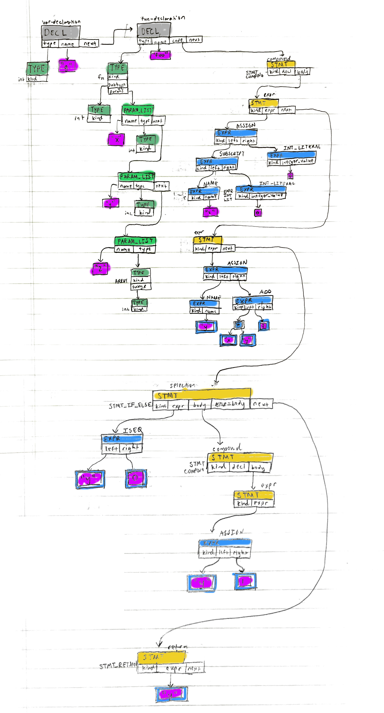

# AST Structure
This compiler was created following tips and tricks from a ree online text book by Douglas Thain viewable [here](https://www3.nd.edu/~dthain/compilerbook/). Chapter 6 in particular talks about the Abstract Syntax Tree.

I think the hardest part of understanding the compiler code is understanding how the AST
is created. Bison has a steep learning curve, but once you are familiar with it it is not that bad.

There are four main terms discussed, declarations, statements, expressions, and types. I suggest reading Chapter 6 in that book first before reading this. Each of these has a C `struct` that defines it.

## Expressions
I think of expressions of math expressions. Parsing expressions like `4*3+8` and the structure of the code is introduced very well in [Chapter 5 of the textbook](https://www3.nd.edu/~dthain/compilerbook/chapter5.pdf). Expressions can also be assigning values (`z=5`), or checking equality (`y == 5`).

```
struct expr {
	expr_t kind;
	struct expr *left;
	struct expr *right;
	const char *name;
	int integer_value;
	const char * string_literal;
};
```

Say we have this code

```
z[0] = 0;
```

This would translate to this tree. We are doing an assignment. We are assigning `0` to `z[0]`.

`0` is an integer literal, which we represent with a `struct expr` with the kind `EXPR_INTEGER_LITERAL`. 

`z[0]` is a little complicated, because it does a subscript. So, we have a `EXPR_SUBSCRIPT` expression, that has a left expression of a `EXPR_STRING_LITERAL` with the name `"z"`. The right expression would be integer literal `0`.


Drawing this out gets annoying, so I abbreviate it.

For example

```
y = x * y + 2
```

I would draw like this to save space.


## Types
A type encodes the type of variables and functions. Integers for example, need to be of "integer type". A
function will have the type function. When defining a function, it also has a return type and types for
its parameters. So, our `type` struct has multiple fields. 

```c
struct type {
	type_t kind;
	struct type *subtype;
	struct param_list *params;
};
```

For example in the simplest case, `int g`, we will just have a type struct saying it is of int. 

```c
struct *type t = malloc(sizeof(t))
t->kind = TYPE_INTEGER
t->subtype = NULL
t->params = NULL
```


### Param List

We have another structure for parameters. Here, the `params` field in the type struct would point to a `param_list` struct.

```
struct param_list {
	char *name;
	struct type *type;
	struct param_list *next;
};
```

Let's say we have a function declaration like this, and focus on the paramters only:
```
int foo(int x, int y, int z[])
```

It would look like this.


It is a linked list of parameters. Notice the last parameter is an array, so it has type `TYPE_ARRAY` and and subtype of `TYPE_INTEGER`.


## Declarations
Declarations state the name, type, and value of a symbol. A symbol is a constant, variable, or a function.

This is the struct to define it
```c
struct decl {
	char *name;
	struct type *type; 
	int array_size;
	struct stmt *code;
	struct decl *next;
	struct symbol *symbol;
};
```

These are best explained with examples. Take this code:

```
int g;
```

This can be visualized like this:


Notice it has the type as described above, and the literal name `"g"`. In semantic analysis, we also add a `symbol` structure to do name resolution and other typechecking.

If we want to declare an entire function

```c
int foo(int x, int y, int z[]) {
	// CODE
}
```


Notice we have a `struct stmt *code` as a property of a declaration. This code will contain statements, which will be discussed below.

## Statements

The body of a function contains statements. A statement is indicating to the program to do a particular action. It can be declaring a local variable, performing an if check, stating a while loop, etc. 

```c
struct stmt {
	stmt_t kind;
	struct decl *decl;
	struct expr *init_expr;
	struct expr *expr;
	struct expr *next_expr;
	struct stmt *body;
	struct stmt *else_body;
	struct stmt *next;
};
```

Notice this has a lot of fields. Most of the time only a few of them are filled.

What was confusing to me was there is a `STMT_EXPR`. I was confused what the difference between a statmenent and an expression was when I learned about this the first time. Statements are like containers. Declarations declare functions, and the contain a list of statements. Statements contain expressions. 

The starting statement is the `STMT_COMPUND`. When you declare a function, the code all is within a compound statement. The compound statement tells you there is a new scope that is entered. An if statement body also will be a compound statement.

Look at this example of a compound statement:

```c
{
	y = 1;
}
```


Here we have a compound statement. The body of the compound statment is a list of statements. There is only one statement, and it is an expression statement (`STMT_EXPR`). This expression statement does an assignment.

If we expand this code to

```c
if (y == 0) {
	y = 1;
}
```


We see we use a `STMT_IF_ELSE`. There is no `else`, so the `else_body` property of the statement struct is just null. The body is a compound statement we see above. And the `expr` is the equality condition `y == 0`.

## All together
Once you understand these pieces, putting them all together is not that bad.

```c
int g;

int foo(int x, int y, int z[])
{
    z[0] = 0;
    y = x * y + 2;

    if(y == 0)
    {
        y = 1;
    }

    return y;
}
```

Try to draw the ast for this. It would look something like this:



Traversing this tree is not that hard. It is just a little annoying, because C is painful. The `tostring.c` file traverses this tree to create a string ([link](https://github.com/varughese/CS1622/blob/master/parser/ast/tostring.c)). It is a good example of traversing the tree. This string would be:

```
[program 
  [var-declaration [int] [g]]
  [fun-declaration 
    [int]
    [foo]
    [params 
      [param [int] [x]] 
      [param [int] [y]] 
      [param [int] [z] [\[\]]]]
    [compound-stmt 
      [= [var [z] [0]] [0]]
      [= [var [y]] 
        [+ 
          [* [var [x]] [var [y]]] [2]]]
      [selection-stmt 
        [== [var [y]] [0]]
        [compound-stmt 
          [= [var [y]] [1]]
        ]
      ]
      [return-stmt [var [y]]]
    ]
  ]
]
```